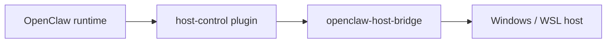

# openclaw-host-bridge

`openclaw-host-bridge` is the canonical host-side enforcement layer for
OpenClaw host control.

It exists for one reason: OpenClaw can run in an isolated container or VM, but
users still want controlled access to the real host PC. The bridge provides
that path without turning the assistant runtime itself into the host trust
boundary.

## What This Repository Owns

This repository owns:

- host-side operation dispatch
- allowed-root enforcement
- permission classes
- export staging
- audit logging
- runtime attestation
- WSL and Windows-oriented host runtime workflows

It does not own:

- Telegram user experience
- host-control tool exposure inside the gateway
- platform rollout or digest approval
- OpenClaw core behavior

## Architecture Role



The bridge is the point where host access becomes real. That is why policy,
audit, and attestation belong here.

## Main Workflow

1. A runtime-side tool request reaches the bridge.
2. The bridge validates the requested operation against typed permissions and
   allowed roots.
3. The bridge performs the host action or stages a delivery artifact.
4. The bridge records evidence through logs, audit output, and runtime
   attestation surfaces.
5. Operators verify the live bridge through host-local health and status
   surfaces.

## Supported Runtime Shape

The current supported model is:

- Windows host
- WSL2-backed bridge runtime
- OpenClaw running separately in an isolated container or VM
- prod bridge always on through `systemd`
- stage bridge available as an on-demand `systemd` unit for test windows only

This split preserves a clean host trust boundary while avoiding an always-on
extra stage listener when stage is suspended.

## Audit And Visibility

The bridge is expected to be independently observable.

- health and runtime attestation:
  - bridge `/healthz`
- operator status:
  - `scripts/status-openclaw-host-stack.sh`
- persistent host logs:
  - `journalctl -u openclaw-host-bridge.service`
  - `journalctl -u openclaw-host-bridge-stage.service`
- policy-aligned audit evidence:
  - local `audit.dir` configured in the policy file
- version and runtime identity:
  - package version
  - git commit
  - PID
  - config path
  - environment file path

For privileged host-control work, a change is not complete unless these
visibility surfaces still make sense after the change.

## Security References

- [`security-architecture/docs/architecture/components/openclaw-host-bridge/README.md`](https://github.com/mfshaf7/security-architecture/blob/main/docs/architecture/components/openclaw-host-bridge/README.md)
- [`security-architecture/docs/architecture/domains/host-control.md`](https://github.com/mfshaf7/security-architecture/blob/main/docs/architecture/domains/host-control.md)
- [`security-architecture/docs/reviews/security-review-checklist.md`](https://github.com/mfshaf7/security-architecture/blob/main/docs/reviews/security-review-checklist.md)
- [`security-architecture/docs/reviews/components/README.md`](https://github.com/mfshaf7/security-architecture/blob/main/docs/reviews/components/README.md)

## Published Interface Contract

This repository publishes the active bridge contract for downstream repos in:

- `contracts/interface-manifest.json`

That manifest is validated by:

```bash
npm run test:interface-contract
```

`openclaw-runtime-distribution` should consume this published contract instead
of grepping private bridge source text.

## Change Governance

When bridge behavior changes, the work should normally include:

- the bridge code or launcher change
- validation or test updates
- host-deployment or security-model doc updates
- provisioning or runtime evidence updates when the live host model changed

Live host-only fixes are containment until the owning repo and provisioning path
reflect them.

## Start Here

Read in this order:

1. [docs/architecture.md](docs/architecture.md)
2. [docs/security-model.md](docs/security-model.md)
3. [docs/wsl-mode.md](docs/wsl-mode.md)
4. [docs/host-deployment.md](docs/host-deployment.md)
5. [docs/install.md](docs/install.md)
6. security review surfaces:
   - [`security-architecture/docs/architecture/components/openclaw-host-bridge/README.md`](https://github.com/mfshaf7/security-architecture/blob/main/docs/architecture/components/openclaw-host-bridge/README.md)
   - [`security-architecture/docs/architecture/domains/host-control.md`](https://github.com/mfshaf7/security-architecture/blob/main/docs/architecture/domains/host-control.md)
   - [`security-architecture/docs/reviews/security-review-checklist.md`](https://github.com/mfshaf7/security-architecture/blob/main/docs/reviews/security-review-checklist.md)
   - [`security-architecture/docs/reviews/components/README.md`](https://github.com/mfshaf7/security-architecture/blob/main/docs/reviews/components/README.md)

## Validation

Run:

```bash
node --test test/*.test.mjs
```

Useful live checks:

```bash
bash scripts/status-openclaw-host-stack.sh
curl http://127.0.0.1:48721/healthz
```

For stage bridge windows:

```bash
curl http://127.0.0.1:48731/healthz
```

## Related Repositories

- `openclaw-telegram-enhanced`
  - Telegram delivery and UX behavior
- `openclaw-runtime-distribution`
  - active stage/prod gateway composition path
- `platform-engineering`
  - host provisioning, stage lifecycle orchestration, and release authority
- `security-architecture`
  - trust-boundary and privileged-control review criteria
