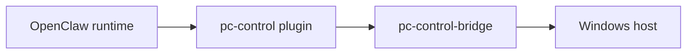

# pc-control-bridge

`pc-control-bridge` is the host-side enforcement layer for OpenClaw host control.

It exists for one reason: OpenClaw can run in an isolated container or VM, but users still want controlled access to the real host PC. The bridge provides that path without turning the assistant runtime itself into the host trust boundary.

## What This Repository Is

This repository implements:

- host-side operation dispatch
- permission classes
- allowed-root enforcement
- export staging
- audit logging
- Windows and WSL-oriented runtime workflows

It is not:

- an OpenClaw core patch
- a generic remote shell
- a replacement for the OpenClaw runtime

## Architecture Role



The bridge is the place where host access becomes real. That is why it owns policy and audit.

## Why The Bridge Exists

Without a separate host bridge, most local-assistant setups end up doing one of these:

- broad shell execution from the assistant runtime
- unstructured scripts with no stable policy boundary
- channel-specific hacks that reach directly into the host

This bridge exists to avoid those failure modes.

## Current Scope

Current main operation areas:

- health and host summary
- file listing and search
- metadata inspection
- folder creation and move/rename
- export staging for Telegram
- desktop screenshots
- monitor power control

## Permission Model

The bridge groups operations into explicit permission classes:

- `read`
- `organize`
- `export`
- `browser_inspect`
- `admin_high_risk`

That separation matters because:

- read-only host insight should stay easy
- mutating file actions should stay deliberate
- export should be separate from ordinary organization
- high-risk admin changes should be gated more tightly

## Supported Mode

The main documented mode in this repo is:

- Windows host
- WSL2-backed bridge runtime
- OpenClaw running separately in an isolated VM or container

This is not a hidden workaround. It is the current supported operating model of this repository.

## Start Here

Read in this order:

1. [docs/architecture.md](/home/mfshaf7/projects/pc-control-bridge/docs/architecture.md)
2. [docs/security-model.md](/home/mfshaf7/projects/pc-control-bridge/docs/security-model.md)
3. [docs/wsl-mode.md](/home/mfshaf7/projects/pc-control-bridge/docs/wsl-mode.md)
4. [docs/install.md](/home/mfshaf7/projects/pc-control-bridge/docs/install.md)

## Tests

Run:

```bash
node --test test/*.test.mjs
```

## Related Repositories

- OpenClaw-side adapter plugin: `pc-control-openclaw-plugin`
- channel-side deterministic Telegram behavior: `telegram-override-plugin`
