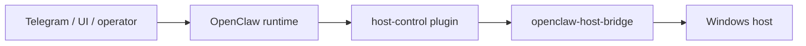

# Architecture

## Purpose

This document explains where `openclaw-host-bridge` sits in the overall system and why it is separate from both OpenClaw core and channel-specific behavior.

## System Position

The bridge is the host-side enforcement point in that chain.

## Separation Of Responsibilities

### OpenClaw runtime

Owns:

- conversation
- routing
- approvals
- tool orchestration

Does not own host policy.

### host-control plugin

Owns:

- typed tool definitions
- confirmation semantics
- bridge request formatting

Does not own host enforcement.

### openclaw-host-bridge

Owns:

- operation allowlists
- allowed roots
- export staging
- audit logging
- host-specific execution

This is why the bridge is the host trust anchor.

## Trust Boundaries

### Boundary 1: runtime

The OpenClaw runtime can ask for host actions, but it should not decide host policy by itself.

### Boundary 2: bridge

The bridge is where host access is allowed or denied.

### Boundary 3: delivery channel

If the system exports files or screenshots through Telegram, that is a separate boundary from host organization and should be treated separately.

## Capability Tiers

### Tier 1: read

- `health.check`
- `fs.list`
- `fs.search`
- `fs.read_meta`

### Tier 2: organize

- `fs.mkdir`
- `fs.move`

### Tier 3: export

- `fs.zip_for_export`
- `fs.stage_for_telegram`
- `display.screenshot`

### Tier 4: higher-risk admin

- allowed-root changes
- host discovery outside allowed roots
- monitor power

## Why This Matters

If the bridge did not exist, users would still want host access. The likely fallback would be broad shell execution or ad hoc scripts. This repository uses the bridge to make host access explicit, typed, and auditable instead.
